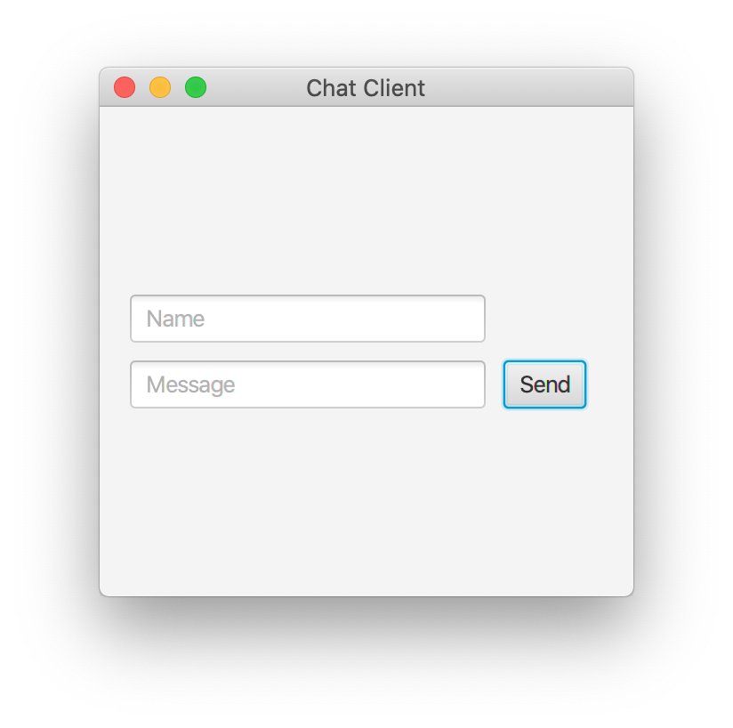

# ChatClient
JavaFX GUI client for sending messages to a server

The client uses a socket to communicate and send messages to the server and it uses JavaFX to provide the GUI.

## Usage

```
java Main [host] [port]
```

## Screenshot



## Server

The server can be found at [bilaalrashid/ChatServer](https://github.com/bilaalrashid/ChatServer)
